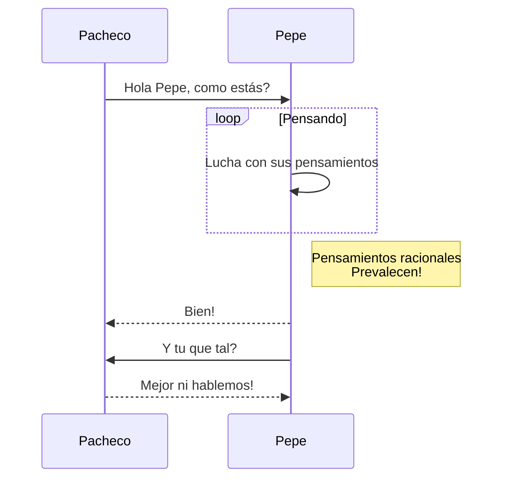

```mermaid
graph TD;
    A-->B;
    A-->C;
    B-->D;
    C-->D;
```

```mermaid
sequenceDiagram
    participant Pacheco
    participant Pepe
    Pacheco->>Pepe: Hola Pepe, como estás?
    loop Pensando
        Pepe->>Pepe: Lucha con sus pensamientos
    end
    Note right of Pepe: Pensamientos racionales <br/>Prevalecen!
    Pepe-->>Pacheco: Bien!
    Pepe->>Pacheco: Y tu que tal?
    Pacheco-->>Pepe: Mejor ni hablemos!
```