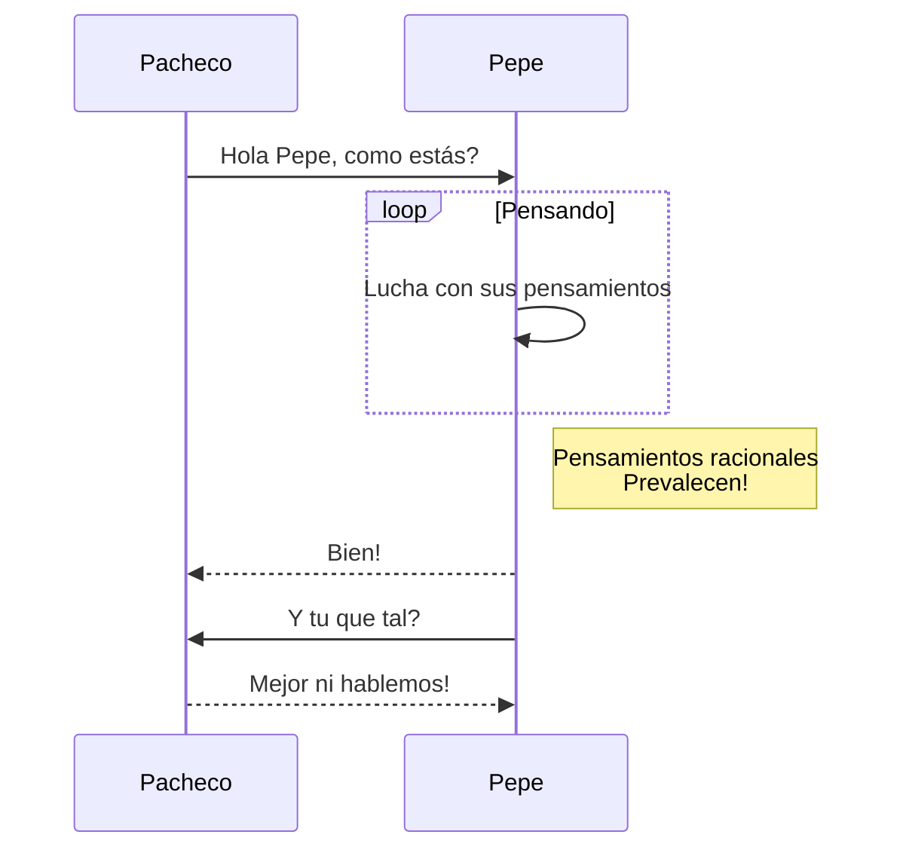

# EJERCICIO DE README CON MARKDOWN

### EJEMPLO DE DIAGRAMAS

Para realizar un **diagrama** emplearemos * *mermaid* *.
La documentación de mermaid se encuentra en el siguiente [enlace](https://mermaid-js.github.io/mermaid/#/).

##### Requisitos:

- [X] Tener una cuenta de GitHub
- [ ] Emplear un editor de textos


```
Ahora bien, tenemos más formas de crear diagramas como puede ser la siguiente
```


@damiancastelao :+1: Que te parece? :shipit:

Aquí tienes una bonita imagen[^1].


[^1]: Extraída de la red.
