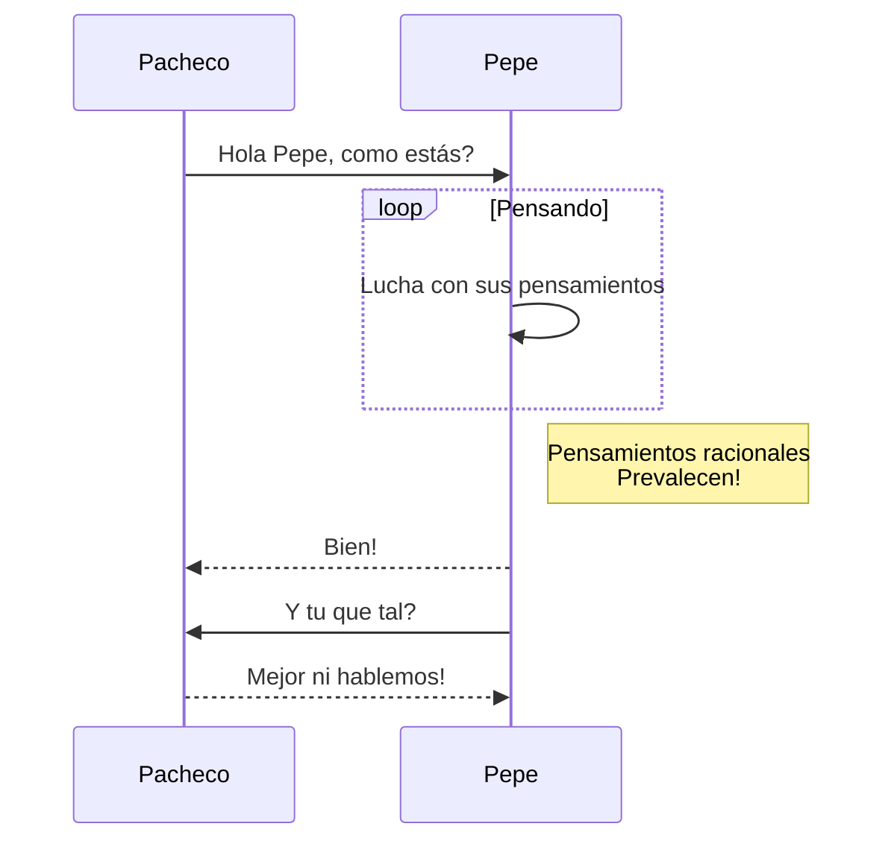

#EJERCICIO DE README CON MARKDOWN#

###EJEMPLO DE DIAGRAMAS###

Para realizar un **diagrama** emplearemos * *mermaid* *.
La documentación de mermaid se encuentra en el siguiente [enlace](https://mermaid-js.github.io/mermaid/#/).


```
Ahora bien, tenemos más formas de crear diagramas como puede ser la siguiente
```


[Contribution guidelines for this project](docs/README.md)